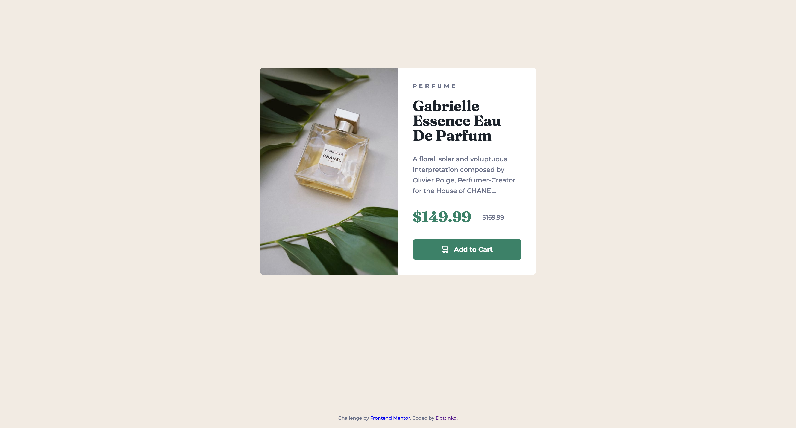

# Frontend Mentor - Product preview card component solution

This is a solution to the [Product preview card component challenge on Frontend Mentor](https://www.frontendmentor.io/challenges/product-preview-card-component-GO7UmttRfa). Frontend Mentor challenges help you improve your coding skills by building realistic projects. 

## Table of contents

- [Overview](#overview)
  - [The challenge](#the-challenge)
  - [Screenshot](#screenshot)
  - [Links](#links)
- [My process](#my-process)
  - [Built with](#built-with)
  - [What I learned](#what-i-learned)
  - [Continued development](#continued-development)


## Overview

### The challenge

Users should be able to:

- View the optimal layout depending on their device's screen size
- See hover and focus states for interactive elements

### Screenshot




### Links

- Solution URL: [Solution on FrontEnd Mentor](https://your-solution-url.com)
- Live Site URL: [Live Site](https://dbttlnkd.github.io/frontend_mentor_product_preview_card_component/)

## My process

### Built with

- HTML5
- CSS
- Flexbox

### What I learned

This is my first design on HTML/CSS for which I had the opportunity to learn about Flexbox.

I had some difficulties on making sure the cart SVG was fully centered on height and I did not succeed with using a ```html <button>``` and ```css::before.```.

I corrected the issue with using ```html <a href"">``` instead. Not sure if this is the best way.

### Continued development

Use this section to outline areas that you want to continue focusing on in future projects. These could be concepts you're still not completely comfortable with or techniques you found useful that you want to refine and perfect.

**Note: Delete this note and the content within this section and replace with your own plans for continued development.**


